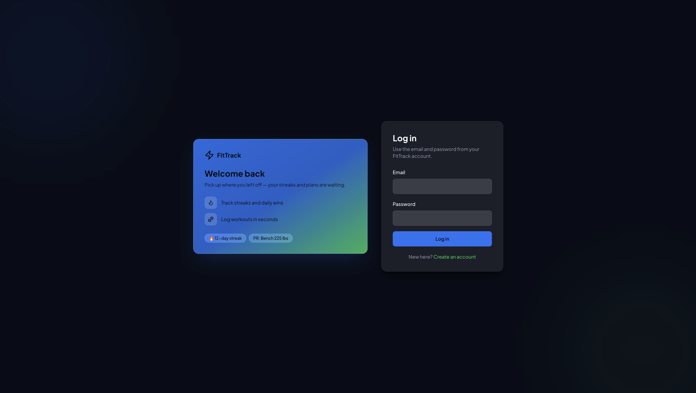
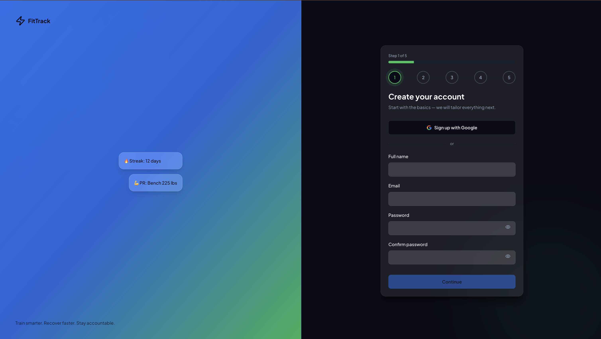
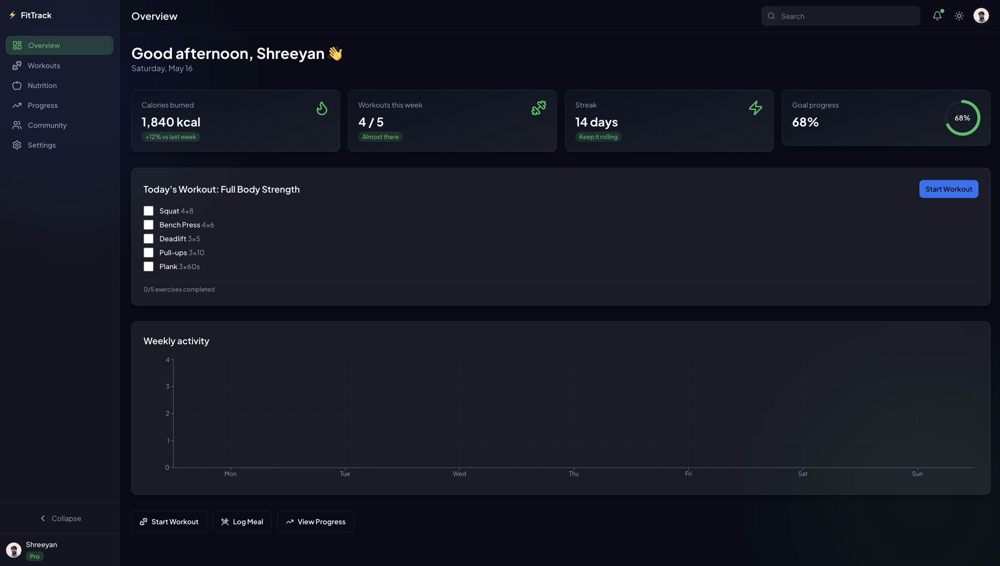
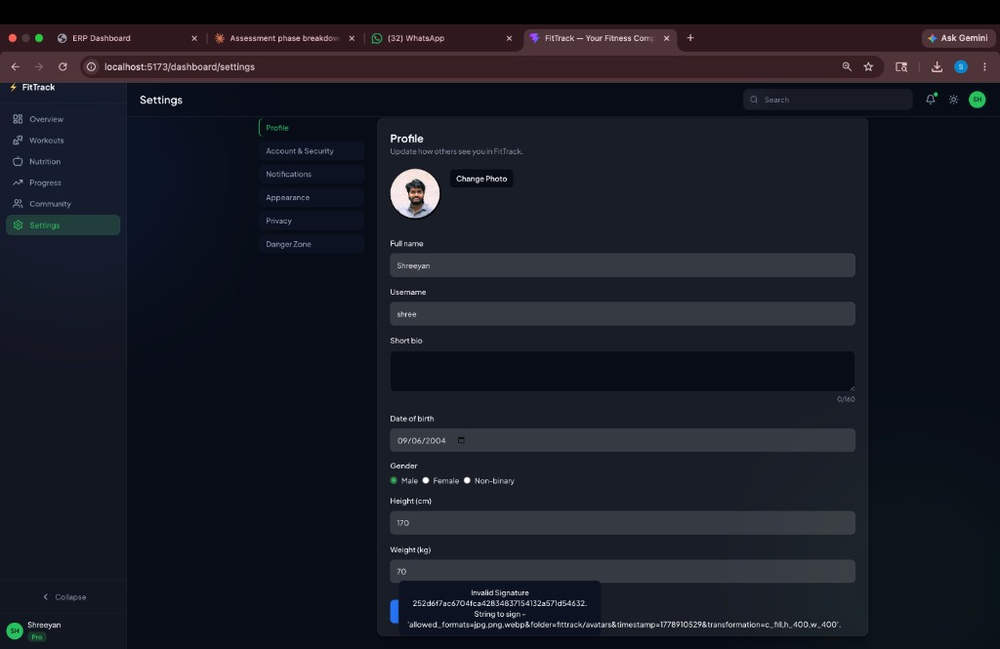

# FitTrack

A full-stack fitness web app: marketing landing page, multi-step onboarding, and a logged-in dashboard for workouts, nutrition, progress, community, and settings. The UI is a React SPA; data and auth live in a separate Express API with MongoDB.

---

## Preview

### Landing (dark mode)



### Signup flow



### Dashboard overview



### Settings — profile



> **GIF / demo video:** Drop a short screen recording at `docs/screenshots/demo.gif` (or link a hosted video in this section) to show signup → dashboard → save profile in one loop.

---

## Tech stack

### Frontend

| Layer | Technology | Notes |
|-------|------------|--------|
| Framework | React 19 + Vite 8 | SPA, fast HMR |
| Routing | React Router 7 | Nested dashboard routes, protected layout |
| Styling | Tailwind CSS 3 | Semantic HSL tokens, dark mode via `class` |
| UI | Radix primitives + shared components | Dialog, switch, tabs, accessible focus |
| Forms | React Hook Form + Zod | Signup steps, login, settings |
| State | Zustand (persist) | Auth session, theme, appearance |
| HTTP | Axios | Bearer token + cookie refresh queue |
| Motion | Framer Motion | Landing entrances, auth transitions |
| Charts | Recharts | Weekly activity on overview |
| Icons | Lucide React | Consistent stroke icons |

### Backend

| Layer | Technology | Notes |
|-------|------------|--------|
| Runtime | Node.js 18+ | ES modules |
| Server | Express 4 | REST under `/api/v1` |
| Database | MongoDB + Mongoose | Users, workouts, nutrition, progress, posts |
| Auth | JWT + httpOnly refresh cookie | Short access token, rotated refresh |
| Validation | Zod | Request bodies in validators |
| Uploads | Multer + Cloudinary (optional) | Avatars; local disk in dev |
| Security | Helmet, CORS, rate limiting | bcrypt passwords |

---

## Setup instructions

### Prerequisites

- **Node.js** 18 or newer  
- **MongoDB** running locally (`mongodb://127.0.0.1:27017`) or a [MongoDB Atlas](https://www.mongodb.com/cloud/atlas) connection string  
- Two terminal windows (API + frontend)

### 1. Clone and install

```bash
git clone <your-repo-url> fittrack
cd fittrack
npm install

cd server
npm install
cd ..
```

### 2. Configure the API

```bash
cd server
cp .env.example .env
```

Edit `server/.env`. Minimum for local dev:

| Variable | Example | Purpose |
|----------|---------|---------|
| `PORT` | `5001` | API port (avoid 5000 on macOS — AirPlay uses it) |
| `MONGO_URI` | `mongodb://127.0.0.1:27017/fittrack` | Database |
| `JWT_SECRET` | 32+ random characters | Access token signing |
| `JWT_REFRESH_SECRET` | different 32+ chars | Refresh token signing |
| `CLIENT_URL` | `http://localhost:5173` | CORS + cookie origin |
| `USE_LOCAL_UPLOADS` | `true` | Store avatars on disk (no Cloudinary account) |

Generate secrets (optional):

```bash
openssl rand -base64 32
```

### 3. Configure the frontend

At the repo root, `.env.development` should contain:

```env
VITE_API_URL=http://localhost:5001
```

Vite loads this automatically in dev. For production builds, set `VITE_API_URL` to your deployed API URL.

### 4. Start MongoDB

**macOS (Homebrew):**

```bash
brew services start mongodb-community
```

**Docker:**

```bash
docker run -d -p 27017:27017 --name fittrack-mongo mongo:7
```

### 5. Run the app

**Terminal 1 — API**

```bash
cd server
npm run dev
```

You should see: `Server listening on port 5001` and `MongoDB connected`.

**Terminal 2 — Frontend**

```bash
npm run dev
```

Open [http://localhost:5173](http://localhost:5173).

### 6. Verify everything works

| Check | How |
|-------|-----|
| API health | `curl http://localhost:5001/api/v1/health` → `"success": true` |
| Signup | `/signup` → complete wizard → lands on `/dashboard` |
| Login | `/login` with the same email/password |
| Profile | Settings → change name → **Save Changes** |
| Avatar | Settings → **Change Photo** → save (uses local uploads if `USE_LOCAL_UPLOADS=true`) |

### Troubleshooting

| Problem | Fix |
|---------|-----|
| `Network Error` on login | API not running, or wrong `VITE_API_URL`. Restart Vite after changing env. |
| CORS error | `CLIENT_URL` in `server/.env` must match `http://localhost:5173` exactly. |
| Port 5001 in use | Stop duplicate `npm run dev` in `server/`, or change `PORT`. |
| Avatar / Cloudinary “Invalid Signature” | Set `USE_LOCAL_UPLOADS=true` or add real `CLOUDINARY_*` keys. |
| Mongo connection failed | Start MongoDB or fix `MONGO_URI`. |

### Production build (frontend only)

```bash
npm run build
npm run preview
```

Deploy the `dist/` folder to any static host. Point `VITE_API_URL` at your live API before building.

More API detail: [`server/README.md`](server/README.md).

---

## Design decisions

### Visual language

- **Typography:** Plus Jakarta Sans (400–800) for a clean, product-style feel without default system fonts.  
- **Color:** HSL CSS variables (`--primary`, `--accent`, `--muted`, etc.) mapped in Tailwind so light and dark themes stay in sync. Accent color is user-selectable in Settings (stored client-side).  
- **Glass surfaces:** Frosted cards and nav (`glass-card`, mesh background on `App`) keep the dashboard readable on gradients without heavy solid panels.  
- **Dark mode:** Class-based (`html.dark`), persisted in Zustand, applied before paint to avoid a flash of wrong theme.

### Motion

- Landing and auth use **short, one-time** entrance animations (`viewport={{ once: true }}` where scrolling matters).  
- Hero background uses a slow gradient shift plus light mouse parallax — enough movement to feel alive, not distracting.  
- Route changes show a thin **top progress bar** so navigation feels responsive on slower networks.

### Information architecture

- **`components/shared`** — generic UI (Button, Card, Input).  
- **`features/landing|auth|dashboard`** — product screens that compose shared pieces.  
- Keeps marketing, onboarding, and app shell separate so each area can evolve without tangling imports.

### Forms and onboarding

- **Five-step signup** with one final API call: collects goals and body metrics up front without five network round-trips.  
- Each step owns validation; the shell calls `submit()` via ref before advancing — same pattern a designer would expect from a wizard.  
- **Login** is a separate, simpler route (`/login`) so returning users are not forced through onboarding again.

### Auth and data shape

- **Access token in memory/localStorage** + **refresh token in httpOnly cookie** balances SPA convenience with XSS resistance.  
- Axios interceptor refreshes on 401 and queues parallel requests — standard pattern, avoids random logouts mid-action.  
- **`mapUserFromApi`** bridges nested API fields (`height: { value, unit }`) and flat UI fields (`heightCm`) so screens did not need a full rewrite when the backend was added.

### Dashboard strategy

- Layout (sidebar, mobile tabs, overview charts) shipped early with **mock data** on some pages; API modules in `src/lib/api/` are ready for workouts, nutrition, progress, and community.  
- Overview weekly chart and Settings profile/avatar are **live** today — useful for demos and as a template for wiring the rest.

### Uploads

- **Cloudinary in production**, **local disk in dev** when credentials are missing — avoids blocking development on a third-party account.

---

## Application flow

### Landing (`/`)

Public marketing: hero, features, pricing, testimonials. CTAs go to `/signup` or `/login`.

### Signup (`/signup`)

1. Account → 2. Personal → 3. Goals → 4. Activity → 5. Profile → `POST /api/v1/auth/signup` → dashboard.

### Login (`/login`)

`POST /api/v1/auth/login` → same session as signup.

### Dashboard (`/dashboard/*`)

Protected by `ProtectedRoute`. Desktop sidebar; mobile bottom nav.

| Route | Page | API wired |
|-------|------|-----------|
| `/dashboard` | Overview | Weekly stats (partial mock UI) |
| `/dashboard/workouts` | Workouts | UI ready |
| `/dashboard/nutrition` | Nutrition | UI ready |
| `/dashboard/progress` | Progress | UI ready |
| `/dashboard/community` | Community | UI ready |
| `/dashboard/settings` | Settings | Profile + avatar |

---

## Authentication flow

```
Signup/Login → accessToken (JSON) + refreshToken (httpOnly cookie)
Each request → Authorization: Bearer <accessToken>
401 → POST /auth/refresh-token (cookie) → retry request
Logout → POST /auth/logout → clear cookie + client state
```

On load, `initAuth()` in `main.jsx` validates the session via `/auth/me` or refresh.

---

## Project structure

```text
fittrack/
  src/                    # React app
    features/landing|auth|dashboard/
    components/shared|ui/
    lib/axios.js + api/
    store/
  server/src/             # Express API
    routes/ controllers/ services/ models/
  docs/screenshots/       # README images (add demo.gif here)
```

---

## Scripts

| Command | Location | Description |
|---------|----------|-------------|
| `npm run dev` | root | Vite dev server (:5173) |
| `npm run build` | root | Production build → `dist/` |
| `npm run preview` | root | Preview production build |
| `npm run dev` | `server/` | API with nodemon (:5001) |
| `npm start` | `server/` | API without reload |

---

## Deployment

- **Frontend:** Vercel, Netlify, etc. Set `VITE_API_URL` at build time.  
- **API:** Railway, Render, Fly. Env from `server/.env.example`; MongoDB Atlas; real Cloudinary or persistent disk for uploads.  
- **CORS:** `CLIENT_URL` = exact frontend origin. **HTTPS** required for secure cookies in production.

---

## License

MIT
